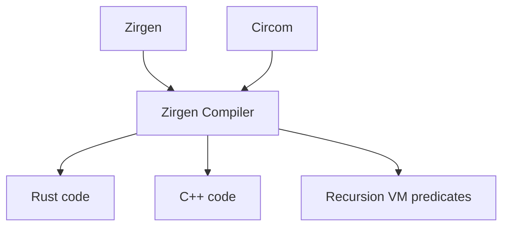

# Zirgen Circuit Compiler

Zirgen is a compiler for a domain-specific language, also called "zirgen",
which creates arithmetic circuits for the RISC Zero proof system.

For the most part, users of RISC Zero should be writing their zkApps in Rust
and using our RISC-V zkVM rather than building them directly in Zirgen.
Sometimes, however, it is necessary or desirable to write parts of an
application as an arithmetic circuit to integrate directly with our proof system
and achieve better performance. In fact, we have an upcoming version of the zkVM
circuit written in Zirgen! Zirgen will make it possible to build accelerators
for important parts of your applications, or even to build entire other VMs that
integrate into the RISC Zero ecosystem through proof composition. With that said,
it's still a work in progress and has quite a few rough edges.

[Getting Started](zirgen/docs/01_Getting_Started.md)

[Language Overview](zirgen/docs/02_Conceptual_Overview.md)

## RISC-V zkVM

This repository also includes the source code of the
[RISC-V circuit](zirgen/circuit/rv32im/v1/) included in our 1.0 release.

## Circom integration

We also have an integration with Circom in the works -- you'll be able to use
the Zirgen compiler to accelerate verification of Circom witnesses for arbirary
Circom circuits.

