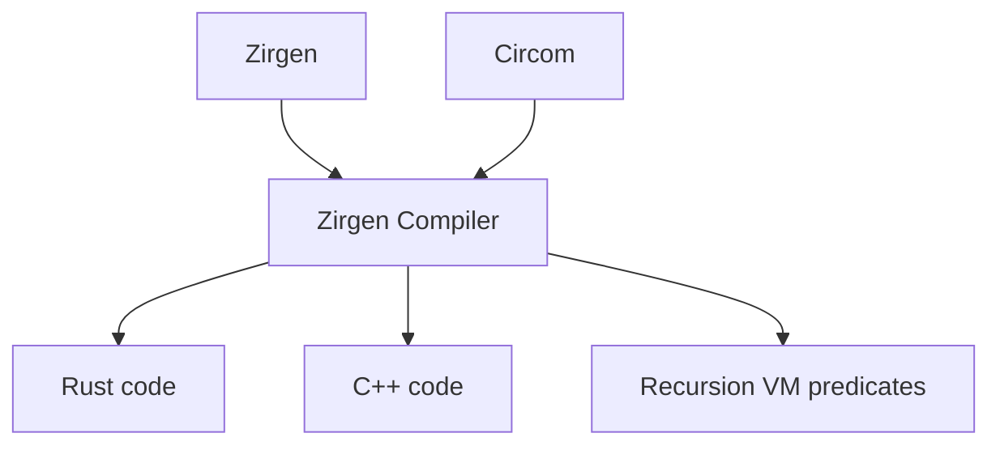

# Zirgen Circuit Compiler

Zirgen is a compiler for a domain-specific language, also called "zirgen",
which creates arithmetic circuits for the RISC Zero proof system.

For the most part, users of RISC Zero should be writing their zkApps in Rust
and using our RISC-V zkVM rather than building them directly in Zirgen.
Sometimes, however, it is necessary or desirable to write parts of an
application as an arithmetic circuit to integrate directly with our proof system
and achieve better performance. In fact, we have an upcoming version of the zkVM
circuit written in Zirgen! Zirgen will make it possible to build accelerators
for important parts of your applications, or even to build entire other VMs that
integrate into the RISC Zero ecosystem through proof composition. With that said,
it's still a work in progress and has quite a few rough edges.

## Documentation

### User Guides
* [Getting Started](zirgen/docs/01_Getting_Started.md)
* [Language Overview](zirgen/docs/02_Conceptual_Overview.md)

### Developer Documentation
* [Architecture](ARCHITECTURE.md) - Compiler structure and MLIR dialects
* [Bazel Build Guide](docs/BAZEL_BUILD_GUIDE.md) - Building and testing
* [Scripts Reference](docs/SCRIPTS_REFERENCE.md) - Development scripts
* [Code Navigation](docs/CODE_NAVIGATION.md) - Finding your way around the codebase

### Technical References
* [Testing in RISC Zero](docs/TESTING_IN_RISC0.md) - Integration workflow
* [Generating CUDA Kernels](docs/GENERATING_CUDA_KERNELS.md) - GPU codegen
* [Multi-Stream Eval Check](docs/MULTI_STREAM_EVAL_CHECK.md) - Performance optimization
* [AGENTS.md](AGENTS.md) - Detailed pipeline and codegen reference

## Contributing

If you're interested in contributing to Zirgen, please see [CONTRIBUTING.md](CONTRIBUTING.md) for guidelines on commit message format and development workflow.

After cloning the repository, run `./scripts/setup-git-hooks.sh` to set up commit message validation.

## Included circuits

* [The recursion circuit](/zirgen/circuit/recursion/)
* [The RISC-V zkVM](/zirgen/circuit/rv32im/) 

## Circom integration

We also have an integration with Circom in the works -- this will make it
possible to generate recursion circuit programs that verify witnesses for
arbitrary Circom circuits. This can be found
[here](/zirgen/compiler/tools/zirgen-r1cs.cpp).

```mermaid
graph TD;
    A[Zirgen] --> B[Zirgen Compiler]
    C[Circom] --> B
    B --> D[Rust code]
    B --> E[C++ code]
    B --> F[Recursion VM predicates]
```
