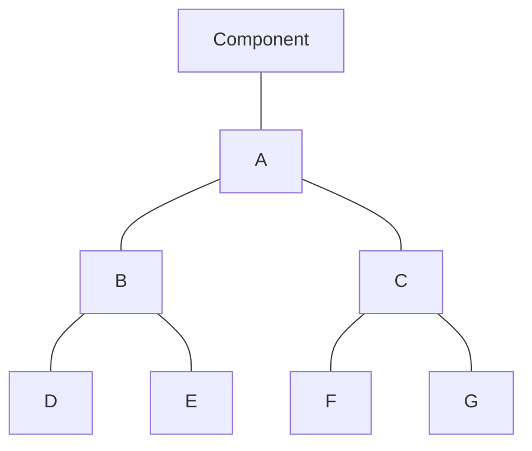

# Muxes

Besides the struct-like components discussed in the last section, the other
primary mode of composing components is with muxes. Similar to how a struct is
an `A` _and_ a `B` _and_ a `C`, a mux is _exactly one of_ an `A` _or_ a `B` _or_
a `C`, much like sum types/unions/variants in other languages. We call each of
these possibilities the _arms_ of the mux, and exactly one of a mux's arms is
_active_ on a particular row of the execution trace. The active mux arm is
determined by an array of field elements called the _selector_, which must be
convertible to `Array<Val, N>` where `N` is the number of arms, and it must be
that the element corresponding to the active arm is 1 and all the other arms are
zero.

The mux of components is itself a component, so we need to give it a suitable definition.

* The value representation of a mux is the disjoint union of its arms' value
  representations
* The layout of a mux is the disjoint union of its arms' layouts, with some
  additional structure discussed later in this section
* The constraint set of a mux is the union of the constraints of its arms
  multiplied by the selector. That is, for a mux with a selector $s$, if the
  $i$-th arm has a constraint $l_{i,j} = r_{i,j}$, then the mux has a constraint
  $s[i] * (l_j - r_j) = 0$.
* The witness generation algorithm of a mux inspects the selector, and runs the
  witness generation algorithm of the active arm.

## Syntax

Unlike struct-like components which are declared at the top level, muxes are
defined by expressions at their place of use with a special syntax, and can be
used anywhere an expression is allowed. The syntax is an expression for the
selector followed by `->`, followed by a parenthesized, comma-separated list of
expressions for the arms.

One simple application of a mux is to do something akin to control flow. For
example, the following circuit shows a pattern to do some initialization in a
component named `Init` on the "first" row of the trace, and to perform some
computational step in a component named `Step` on all subsequent rows.

```
component CycleCounter() { ... }

component Top() {
  cycle := CycleCounter();

  [cycle.is_first, 1 - cycle.is_first] -> (
    Init(),
    Step()
  );
}
```

This circuit instantiates a `CycleCounter` component that provides a reliable
way to count cycles and distinguish a "first" row of the trace (TODO: write a
separate document on implementing `CycleCounter`). Then, if it is the first
cycle, then the mux behaves like the `Init` arm, and otherwise it behaves like
the `Step` arm. In fact, there's syntactic sugar for `if`/`else` clauses that
might make this look a bit more familiar. This code is exactly the same as the
previous example:

```
component Top() {
  first := NondetReg(IsFirstCycle());

  if (first) {
    Init()
  } else {
    Step()
  }
}
```

## Super Components

We mentioned just a moment ago that muxes are expressions, which raises an
interesting question: what is the "type" of a mux expression? Clearly, if all
the arms have the same types, the mux should be able to be used as that type. It
would be quite restrictive to forbid this, and indeed the following logs either
"a is 5" or "a is 7" depending on the value of `cond`.

```
component Top() {
  ...
  a := if (cond) { 5 } else { 7 };
  Log("a is %u", a);
}
```

Consider instead a more complicated case like the following, where the mux arms
have the slightly different types `NondetReg` and `Val`. Well, a `NondetReg` is
already very similar to a `Val` in that you can apply field operations to it,
pass it to constructors that expect a `Val`, and use it every other way that you
can use a `Val`.

```
component Top() {
  ...
  a := if (cond) { NondetReg(GetCycle()) } else { 0 };
  Log("a is %u", a);
}
```

The reason that this works is that a `NondetReg` can be converted to a `Val`
through its super chain. Since a mux must have exactly one active arm, but in
general any of them may be active depending on the row of the trace, the mux
should be convertible to any type that all the arms can be — and since a type is
convertible to any type in its super chain, a mux's super type is the _least
common super type_ of its arms.

The least common super type of a set of components is the first type that occurs
in the super chain of all of the members of the set. To give some examples,
consider this type hierarchy:



The following are all true statements:
* The least common super of {`B`} is `B`
* The least common super of {`B`, `C`} is `A`
* The least common super of {`D`, `E`} is `B`
* The least common super of {`B`, `D`} is `B`
* The least common super of {`B`, `F`} is `A`

One last note on the topic of least common supers: the word "least" is chosen
because it is the common super type that appears "lowest" in the type hierarchy
diagram. This ties to the fact that algebraically the set of component types
form a semilattice with the least common super as the join operation.

## Layout

The layout of a mux in practice is the layout of its active arm, but it's
advantageous to give it some additional structure. Since the type of a mux
expression is the least common super of all its arms, it is often useful to
refer to its value in previous cycles. The least common super of the mux is
guaranteed to have the same layout in all arms, while all other registers used
by an arm may be reused across mux arms. No guarantee is made for registers
outside the common super; taking backs on these registers reads from an
undefined register on the indicated cycle.

Consider the following example. The mux has a common super of `Reg`, and so the
final `Reg` constructor invocations from each mux arm land in the same column.
However, the first mux arm uses two "scratch" registers, `x` and `y`, whereas
the second only uses one scratch register, `z`. The compiler could place `z` in
the same column as `x`, `y`, or possibly neither.

```
component Top() {
  ...
  [a, b] -> ({
    x := Reg(...);
    y := Reg(...);
    Reg(x * (x + 1) * y * (y + 1))
  }, {
    z : Reg;
    z := Reg(z@1 + 2); // Undefined behavior!
    Reg(z * z * z)
  })
  ...
}
```

## Degree considerations

Since the selector gets multiplied into all the constraints of its arms, those
constraints have their degree increased by the degree of the corresponding
selector. Because the degree of constraints in the circuit can be at most 5,
sometimes this is an important programming consideration. Consider this:

```
component Top() {
  x := Reg(...);
  y := Reg(...);
  z := Reg(...);

  // Ensure mux arms are mutually exclusive
  x * y * z = 0;
  x * y + y * z + x * z = 1;

  [x * y, y * z, x * z] -> ({
    (x - 1) * (x - 2) * (x - 3) = 0;
  }, {
    (y - 4) * (y - 5) * (y - 6) = 0;
  }, {
    (z - 7) * (z - 8) * (z - 9) = 0;
  })
}
```

Despite using constraints that appear to be degree 3 in the mux, the fact that
they occur inside mux arms with selectors of degree 2 increases their degree to
5. For this particular circuit, the full constraint set is:

* $xyz = 0$ (degree 3)
* $xy + yz + xz = 0$ (degree 2)
* $xy(x - 1)(x - 2)(x - 3) = 0$ (degree 5)
* $yz(y - 4)(y - 5)(y - 6) = 0$ (degree 5)
* $xz(z - 7)(z - 8)(z - 9) = 0$ (degree 5)

[Prev](04_Components.md)
